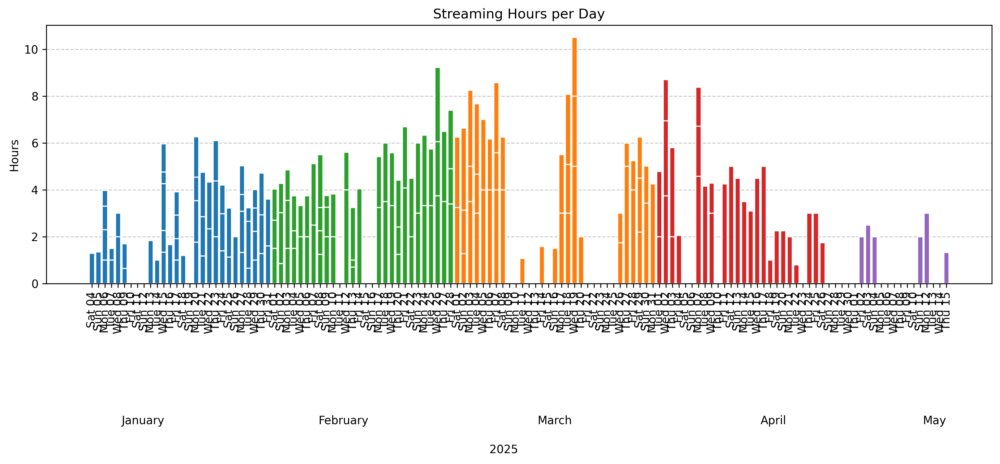

## Mandarin Progression
[https://nebiyuelias1.github.io/Mandarin-progression/](https://nebiyuelias1.github.io/Mandarin-progression/)
How to use:
- change the stream_time.json value every time I end my stream

Progress:

